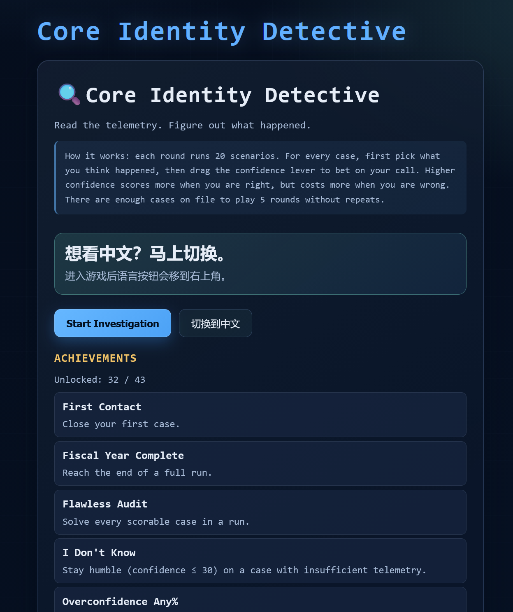
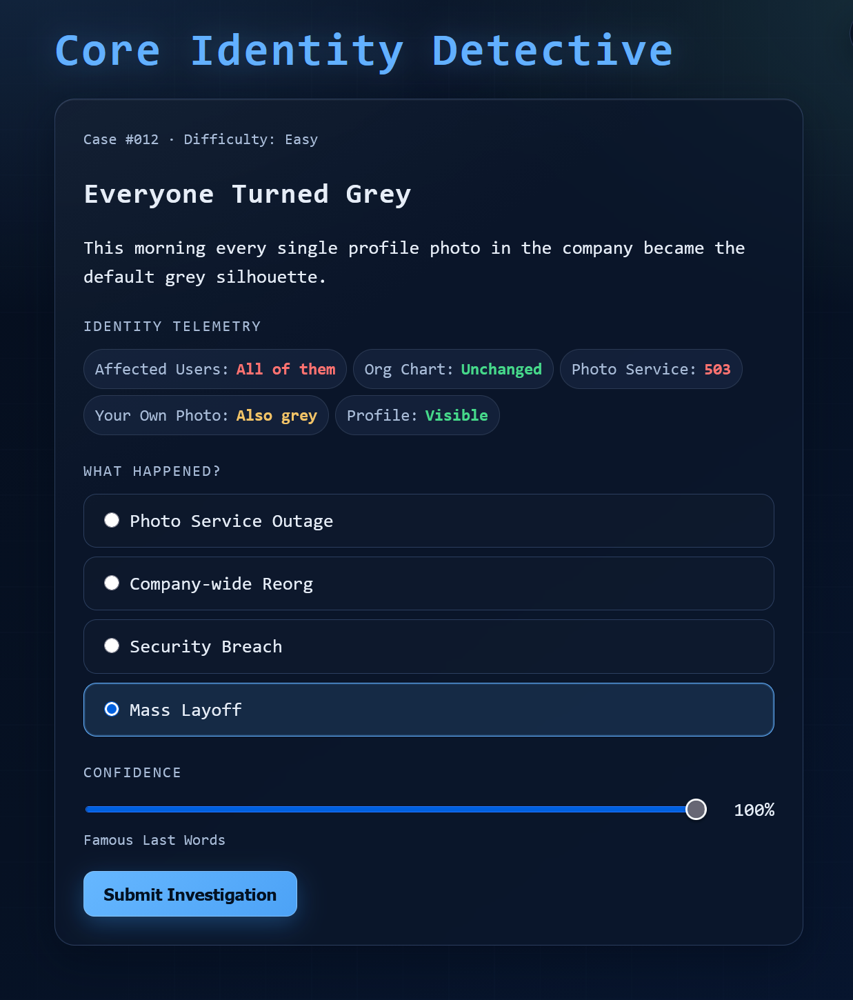
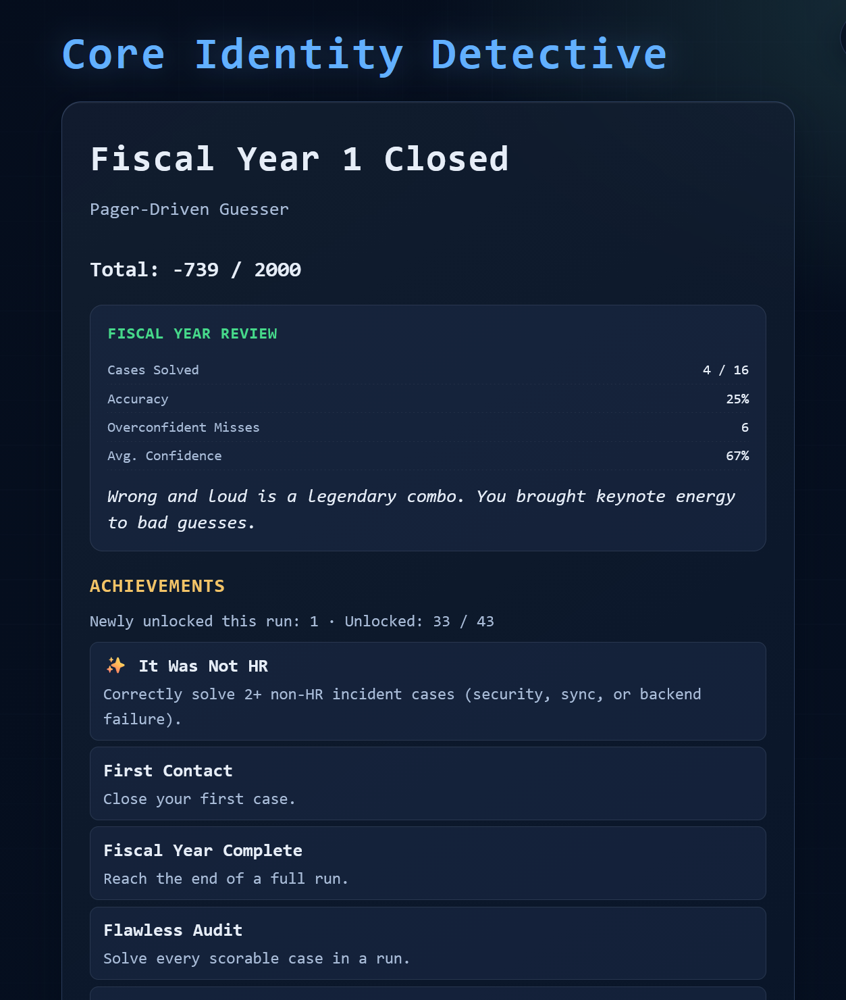

# Core Identity Detective

> Read the telemetry. Figure out what happened.
>
> 有限信息，无限脑补。

A workplace detective game where confidence is a liability.

## Why play

- 1-minute rounds
- Dry corporate humor
- Confidence kills
- Some cases have no answer
- English & 中文
- Works on any screen

## Play

- Online: <https://sayaka-4987.github.io/Core-Identity-Detective/>
- Local: git clone, open index.html (no backend, no build)

## Scoring

- Correct: 50 + confidence / 2
- Wrong: -confidence

100 cases. 20 per run. No repeats until you've seen them all.

## Notes

- License: GNU General Public License v3.0
- All content is fictional. No real employee data is used. 
- In this project, AI helped write JavaScript code, translate text, and polish prose.
- The humor, questionable life choices, and emotional damage were all handcrafted by a human being.

## Screenshots

